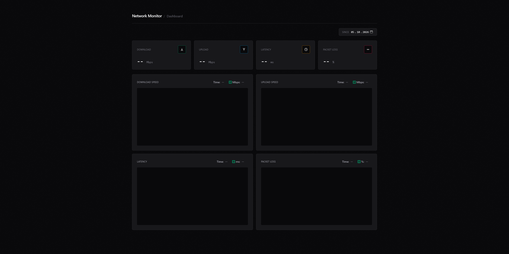

<div align="center">
  <h1>Network Monitor</h1>
  <p>Lightweight, self-hosted monitoring of internet connection stability, with a history of speed, latency and packet loss.</p>
  <p>
    
    
    
    
    
    
  </p>
</div>

## Overview

Network Monitor is a small application for tracking the quality of an internet connection over time. It runs the [Ookla Speedtest CLI](https://www.speedtest.net/apps/cli) every 5 minutes, stores the results in a local SQLite database and presents them on a dashboard with charts and averages for a selected time range. It's designed to be minimal and easy to run in a container.

- Measures download speed, upload speed, ping and packet loss.
- Keeps the full measurement history in a local SQLite database.
- Provides a simple dashboard for browsing the collected data.

## Preview



## Getting started

### 1. Run with Docker

For the fastest setup, run the prebuilt Docker image:

```bash
docker run -d \
  --name network-monitor \
  -p 8080:8080 \
  -v network-monitor-storage:/app/storage \
  ghcr.io/r1pk/network-monitor:latest
```

Once launched, the application is available on the host's port `8080`, with one named volume that keeps the collected data intact between restarts:

- `network-monitor-storage` - stores the application's SQLite database.

### 2. Open the dashboard

Once the container is running, the dashboard becomes available at [http://127.0.0.1:8080](http://127.0.0.1:8080).

> [!NOTE]
> The first data point appears after the first scheduled measurement, which takes up to 5 minutes.

## Configuration

Everything is set through environment variables. Each variable has a sensible default, so no further configuration is typically required.

| Variable             | Default | Description                                                                                          |
| -------------------- | ------- | ---------------------------------------------------------------------------------------------------- |
| `SPEEDTEST_CLI_ARGS` | -       | Extra arguments passed to the Speedtest CLI, e.g. `--server-id=1234` to always test the same server. |

## Development

The repository includes a Docker Compose configuration with live reload for both the server and the client.

1. Clone the repository:

   ```bash
   git clone https://github.com/r1pk/network-monitor.git
   cd network-monitor
   ```

2. Create the `.env` files from the templates:

   ```bash
   cp server/.env.default server/.env
   cp client/.env.default client/.env
   ```

3. Build and start the containers:

   ```bash
   docker compose up -d --build
   ```

Once it's running, the application is available at [http://127.0.0.1:3000](http://127.0.0.1:3000).

## License

Licensed under the [MIT License](LICENSE.md).

## Author

**Patryk Krawczyk** - [@r1pk](https://github.com/r1pk)
